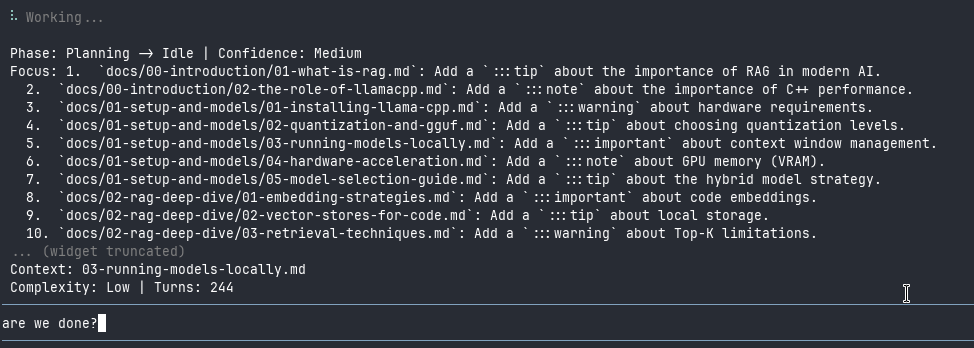

# 🌌 Cognitive Visuals Enhancer for `pi-mono`



This **Pi-Mono** extension is a high-fidelity transparency layer for the Pi Coding Agent. It transforms the AI's "black box" reasoning process into a structured, real-time cognitive stream, reducing visual noise and providing deep insights into the agent's mental trajectory—all within your TUI.

---

## 🚀 The Value Proposition

When working with powerful AI agents, the most critical information isn't just the final code—it's the **intent**, the **confidence**, and the **trajectory** of the reasoning.

The extension eliminates the need to scroll through massive logs to understand why an agent is doing something. Instead, it exposes the agent's internal state through a series of concise, non-intrusive widgets.

---

## 🧠 Deep-State Visibility

The Extension doesn't just show that the agent is "thinking"; it analyzes *how* it is thinking across several cognitive layers:

### 1. Intent & Goal Hierarchy
- **Dynamic Focus**: See exactly what the agent is focusing on right now and what it intends to do next, exposes complete paragraphs of intent, ensuring no critical detail is lost to trimming.

### 2. Semantic Phase Detection
Real-time categorization of the agent's current activity:
- **Analysis**: Investigating the codebase and searching for patterns.
- **Planning**: Designing the solution and outlining steps.
- **Coding**: Actively implementing changes.
- **Verification**: Running tests and validating the fix.

### 3. Confidence & Health
- **Confidence Scoring**: Detects linguistic markers to expose the agent's certainty (**High** | **Medium** | **Low**).
- **Stuck Detection**: Automatically flags when the agent is looping or confused (e.g., "wait, let me rethink...").

---

## 🛠️ Developer Experience (DX) Enhancements

### 🔍 Intelligent Diff Management
Tired of scrolling through hundreds of lines of unchanged code?
- **Concise Mode**: Automatically hides irrelevant context, replacing it with subtle indicators, while preserving critical adjacent lines.
- **Adaptive Switching**: Automatically reverts to **Full Diff** mode if an operation fails, ensuring zero data loss during debugging.
- **Instant Recovery**: Use `/diff-full` to instantly restore the original diff for the last operation.

### 📂 Contextual Awareness
- **Working Set Tracking**: Maintains a real-time list of all files the agent is currently manipulating.
- **Concept Extraction**: Identifies and exposes the key technical entities (Classes, Modules, Functions) the agent is conceptually focusing on.
- **Privacy First**: Automatically masks sensitive data (API keys, tokens, secrets) in tool calls and diffs to prevent accidental exposure in the TUI.

---

## 🎨 The TUI Experience

This extension populates your interface with a suite of one-liner widgets:

| Widget | Purpose | Example |
| :--- | :--- | :--- |
| `agent-status` | Reasoning tier & health | `Reasoning...` or `Stuck: Agent is looping...` |
| `agent-state` | Phase & Confidence | `Phase: Analysis -> Planning \| Confidence: High` |
| `agent-focus` | Current & Next focus | `Focus: Fix auth bug \n\n Next: Run tests` |
| `agent-concepts` | Conceptual focus | `Concepts: AuthProvider, SessionToken` |
| `agent-context` | Active files | `Context: auth.ts, user-service.ts` |
| `agent-stats` | Turn & complexity metrics | `Complexity: Medium \| Turns: 5` |
| `agent-tool` | Active tool call | `Tool: [core] read: src/index.ts` |

---

## 🚀 Quick Start

### Installation

```bash
pi install git:github.com/naranyala/pi-ext-expose-reasoning-process-visuals
```

### Configuration
- `/visuals`: Open the TUI settings menu to toggle Diff Modes.
- `/diff-full`: Recover the last modified file's complete diff.

---

## 🏗️ Technical Architecture

Built for performance and extensibility:
- **Feature/Registry Pattern**: Core logic is decoupled into independent `Feature` modules, making it trivial to add new cognitive monitors.
- **Zero-Latency Analysis**: Uses optimized regex-based heuristics to analyze thinking streams without blocking the agent's runtime.
- **Proxy-Based API**: A clean wrapper around the Pi Extension API for a superior developer experience.

---

## 📄 License

Distributed under the MIT License. See `LICENSE` for more information.
